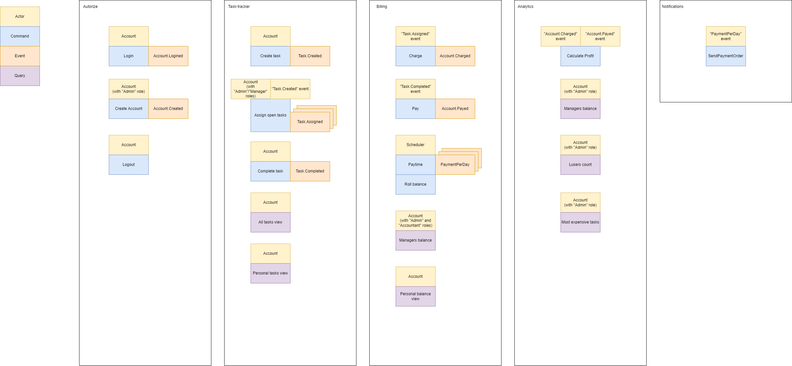

# Проектирование aTES
## 1. Собираем требования
### Нефункцианальные требования 
1. Никакого реалтайма тоже не нужно, хватит рефреша страницы для всех дашбордов и пользовательского интерфейса.  
2. Вопрос нагрузки не стоит, можно считать, что максимальное количество пользователей будет не больше 100 пользователей в минуту.

### Функцианальные требования
В ходе обсуждения задачи с топ-менеджментом были выявлены следующие требования:

#### Таск-трекер
1. Таск-трекер должен быть отдельным дашбордом и доступен всем сотрудникам компании UberPopug Inc.
    - **Список задач должен быть доступен всем попугам.**
    
2. Авторизация в таск-трекере должна выполняться через общий сервис авторизации UberPopug Inc (у нас там инновационная система авторизации на основе формы клюва).
    - **Все попуги могут авторизоваться в одном месте.**
    
3. В таск-трекере должны быть только задачи. Проектов, скоупов и спринтов нет, потому что они не умещаются в голове попуга.
    - **Попуги-работяги могут просматривать только задачи.**
    
4. Новые таски может создавать кто угодно (администратор, начальник, разработчик, менеджер и любая другая роль). У задачи должны быть описание, статус (выполнена или нет) и рандомно выбранный попуг (кроме менеджера и администратора), на которого заассайнена задача.
    - **Все авторизованные попуги могут создавать задачи.**
    - **Задача должна иметь описание, статус (выполнена или нет), попуга, к которому привязана задача (кроме менеджера и админисстратора)**
    
5. Менеджеры или администраторы должны иметь кнопку «заассайнить задачи», которая возьмёт все открытые задачи и рандомно заассайнит каждую на любого из сотрудников (кроме менеджера и администратора) . Не успел закрыть задачу до реассайна — сорян, делай следующую.
    a) Ассайнить задачу можно на кого угодно (кроме менеджера и администратора), это может быть любой существующий аккаунт из системы.
    b) Ассайнить задачу на нового попуга, можно только кнопкой «заассайнить задачи», других вариантов нет
    c) При нажатии кнопки «заассайнить задачи» все текущие не закрытые задачи должны быть случайным образом перетасованы между каждым аккаунтом в системе
    d) Мы не заморачиваемся на ограничение по нажатию на кнопку «заассайнить задачи». Её можно нажимать хоть каждую секунду.
    e) На одного сотрудника может выпасть любое количество новых задач, может выпасть ноль, а может и 10.
    f) Создать задачу не заасайненую на пользователя нельзя. Т.е. любая задача должна иметь попуга, который ее делает
    - **Менеджер или администратор имеют возможность рандомно перепривязать все открытые задачи.**
    - **Созданная задача привязывается к рандомному попугу.**
    
6. Каждый сотрудник должен иметь возможность видеть в отдельном месте список заассайненных на него задач + отметить задачу выполненной.
    - **Каждый авторизованный попуг может видеть список своих задач**
    - **Каждый авторизованный попуг может отметить свою задачу выполненной**


#### Аккаунтинг: кто сколько денег заработал
1. Аккаунтинг должен быть в отдельном дашборде и доступным только для администраторов и бухгалтеров.
    a) у обычных попугов доступ к аккаунтингу тоже должен быть. Но только к информации о собственных счетах (аудит лог + текущий баланс). 
    b) У админов и бухгалтеров должен быть доступ к общей статистике по деньгами заработанным (количество заработанных топ-менеджментом за сегодня денег + статистика по дням).
    - **Попуги-работяги могут видеть информацию только о собственных счетах (аудит-лог + текущий баланс.)**
    - **Админы и бугалтера могут видеть общую статистику по заработанным деньгам (кол-во заработанных топ-менеджментом за сегодня денег + статистика по дням)**


2. Авторизация в дешборде аккаунтинга должна выполняться через общий сервис аутентификации UberPopug Inc.
    - **Все попуги могут авторизоваться в одном месте.**
    
3. У каждого из сотрудников должен быть свой счёт, который показывает, сколько за сегодня он получил денег. У счёта должен быть аудитлог того, за что были списаны или начислены деньги, с подробным описанием каждой из задач.
    - **Все попуги могут видеть информацию о собственном счете (аудит-лог того, за что были списаны или начислены деньги, с подробным описанием каждой из задач + текущий баланс)**
    
4. Расценки:
- цены на задачу определяется единоразово, в момент появления в системе (можно с минимальной задержкой)
- цены рассчитываются без привязки к сотруднику
- формула, которая говорит сколько списать денег с сотрудника при ассайне задачи — rand(-10..-20)$
- формула, которая говорит сколько начислить денег сотруднику для выполненой задачи — rand(20..40)$
- деньги списываются сразу после ассайна на сотрудника, а начисляются после выполнения задачи.
- отрицательный баланс переносится на следующий день. Единственный способ его погасить - закрыть достаточное количество задач в течение дня.
    - **Цена на задачу определяется в момент ее создания (можно с минимальной задержкой).**
    - **При назначении задачи на попуга, с него списывается рандомная сумма (rand(-10..-20)$)**
    - **При выполнении задачи попугом, ему начисляется рандомная сумма (rand(20..40)$)**
    
5. Дешборд должен выводить количество заработанных топ-менеджментом за сегодня денег.
    a) т.е. сумма всех закрытых и заасайненых задач за день с противоположным знаком: (sum(completed task amount) + sum(assigned task fee) * -1
6. В конце дня необходимо:
    a) считать сколько денег сотрудник получил за рабочий день
    b) отправлять на почту сумму выплаты.
    - **В конце каждого дня, каждый попуг должен получить информацию с суммой выплаты за прошедший день.**
    
7. После выплаты баланса (в конце дня) он должен обнуляться, и в аудитлоге всех операций аккаунтинга должно быть отображено, что была выплачена сумма.
    -  **В конце дня каджый попуг с положительным балансом получает выплату (его баланс обнуляется) и обновление аудит-лога с отображением что сумма выплачена.**
    - **Отрицательный баланс попугов переносится в неизменном виде на следующий день.**
8. Дашборд должен выводить информацию по дням, а не за весь период сразу.
    a) вообще хватит только за сегодня (всё равно попуги дальше не помнят), но если чувствуете, что успеете сделать аналитику за каждый день недели — будет круто

#### Аналитика

1. Аналитика — это отдельный дашборд, доступный только админам.
    - Аналитику могут посмотреть только попуги-админы
    
2. Нужно указывать, сколько заработал топ-менеджмент за сегодня и сколько попугов ушло в минус.
    - Отобразить заработок топ-менеджмента
    -  Отобразить список попугов ушедших в минус
    
3. Нужно показывать самую дорогую задачу за день, неделю или месяц.
    a) самой дорогой задачей является задача с наивысшей ценой из списка всех закрытых задач за определенный период времени
    b) пример того, как это может выглядеть:
    ```
    03.03 — самая дорогая задача — 28$
    02.03 — самая дорогая задача — 38$
    01.03 — самая дорогая задача — 23$
    01-03 марта — самая дорогая задача — 38$
    ```
    - **Отобразить самую дорогую задачу за день/неделю/месяц (самой дорогой задачей является задача с наивысшей ценой из списка всех закрытых задач за определенный период времени)**
    
    
## 2. Описываем query/comands 

### Authorize
- *(command) Все попуги могут авторизоваться в одном месте.*
```
Actor: Account
Command: Login
Data: Popug credentials
Event: Account.Logined
```

- *Разлогинивание*
```
Actor: Account
Command: Logout
Data: AccountId
Event: ???
```

- *Создание пользователя*
```
Actor: Account (with "Admin" role)
Command: Create Account
Data: Popug credentials
Event: Account.Created
```

### Task-tracker
- *(command) Все авторизованные попуги могут создавать задачи.*
```
Actor: Account
Command: Create task
Data: Task info with price
Event: Task.Created
```

- *(command) Менеджер или администратор имеют возможность рандомно перепривязать все открытые задачи.*
```
Actor: Account, "Task.Created" event
Command: Assign open tasks
Data: Task
Event: Task.Assigned
```

- *(command) Каждый авторизованный попуг может отметить свою задачу выполненной*
```
Actor: Account
Command: Complete task
Data: Task
Event: Task.Completed
```
- *(query, read model) Список задач должен быть доступен всем попугам.*
- *(query, read model) Попуги-работяги могут просматривать только задачи.*
- *(query, read model) Каждый авторизованный попуг может видеть список своих задач*

### Billing
- *(command) При назначении задачи на попуга, с него списывается рандомная сумма (rand(-10..-20)$)*
```
Actor: "Task.Assigned" event
Command: Charge
Data: Task, AccountId
Event: Account.Charged
```
- *(command) При выполнении задачи попугом, ему начисляется рандомная сумма (rand(20..40)$)*
```
Actor: "Task.Completed" event
Command: Pay
Data: Task, AccountId
Event: Account.Payed
```

- - *(command) В конце дня каджый попуг с положительным балансом получает выплату (его баланс обнуляется) и обновление*
```
Actor: Scheduler
Command: Paytime
Data: AccountId
Event: PaymentPerDay
```
```
Actor: Scheduler
Command: Roll balance
Data: AccountId
Event: ???
```
- (query, read model) Админы и бугалтера могут видеть общую статистику по заработанным деньгам (кол-во заработанных топ-менеджментом за сегодня денег + статистика по дням)
- (query, read model) Все попуги могут видеть информацию о собственном счете (аудит-лог того, за что были списаны или начислены деньги, с подробным описанием каждой из задач + текущий баланс)

### Analytics
- *Подсчет выручки*
```
Actor: "Account.Charged" event, "Account.Payed" event
Command: Calculate Profit
Data: Task (Price)
Event: ???
```
- (query, read model) Аналитику могут посмотреть только попуги-админы. Отобразить заработок топ-менеджмента. Отобразить список попугов ушедших в минус. Отобразить самую дорогую задачу за день/неделю/месяц (самой дорогой задачей является задача с наивысшей ценой из списка всех закрытых задач за определенный период времени)

### Notifications
- *Отправка уведомления о начислении*
```
Actor: "PaymentPerDay" event
Command: SendPaymentOrder
Data: Payment
Event: ???
```



## 3. Модель данных


## 4. Общие данные

- Информация об аккаунте (tasks, billing)
- Информация о задачах (billing)

## 5. Сервисы


Service-Domain Схема + Сервис нотификации для отправки уведомлений
Все связи между сервисами сделаем асинхронными считая, что небольшая задержка в нашем случае не критична. 
Все данные встречающиеся в разных доменах будем транслировать через CUD-events

## 6. События, необходимые для работы системы

Event | Producer | Consumer
------------ | ------------- | -----------
Account.Logined | Auth | Task-tracker, Billing, Analytics
PaymentPerDay | Billing | Notification
Task.Created | Task | Billing
Task.Assigned | Task | Task, Billing
Task.Completed | Task | Billing
Account.Charged | Billing | Analytics
Account.Payed | Billing | Analytics
PaymentPerDay | Billing | Notification


### CUD события и данные этих событий, необходимыe для работы системы

Event | Producer | Consumer
------------ | ------------- | -----------
CUD for Account | Auth | Task, Billing
CUD for Task | Task |  Billing